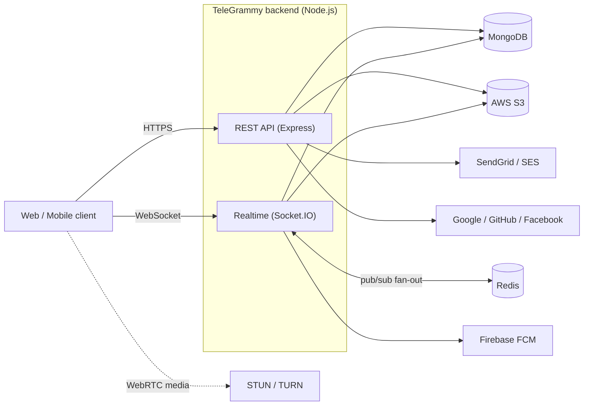
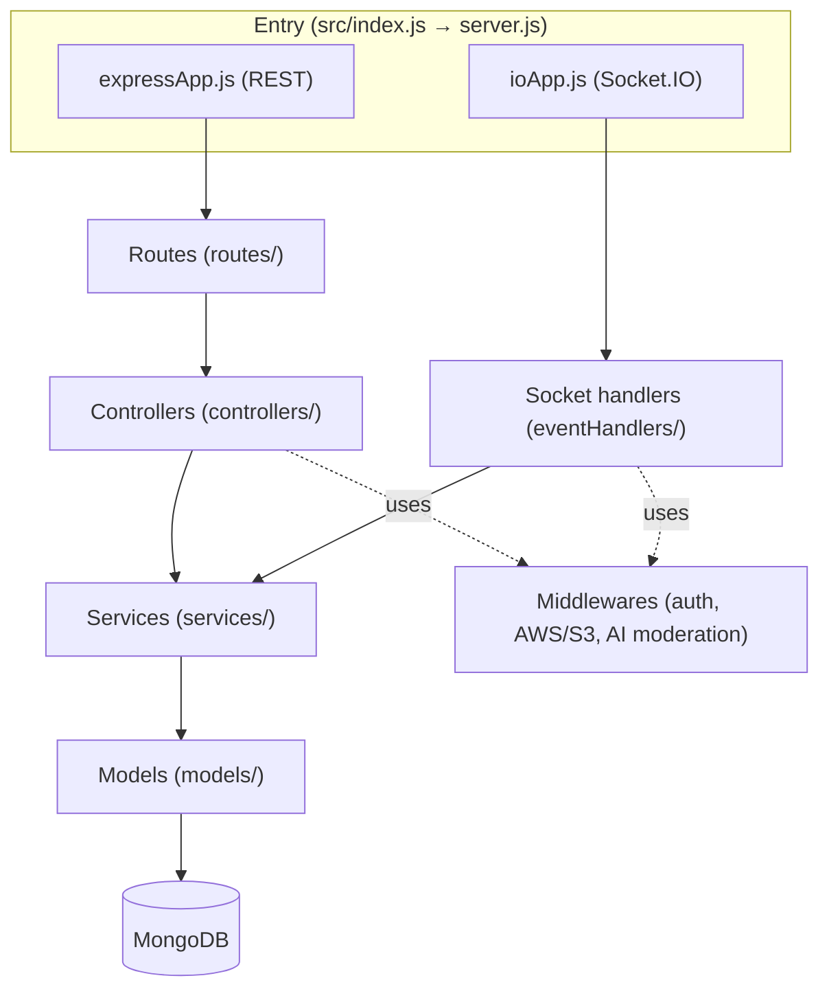
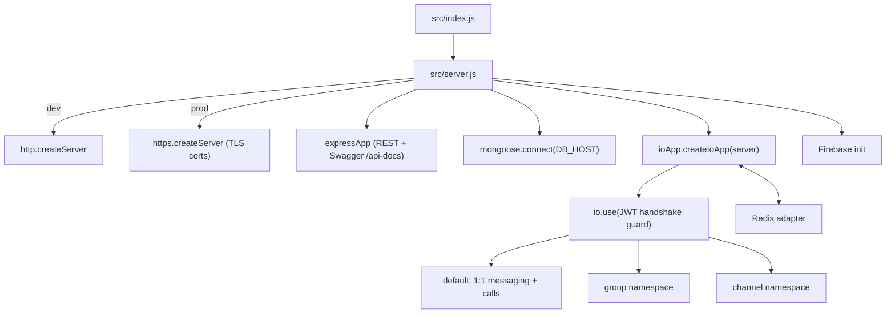
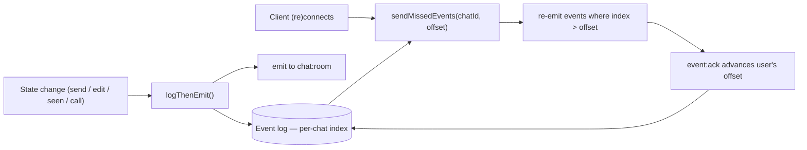
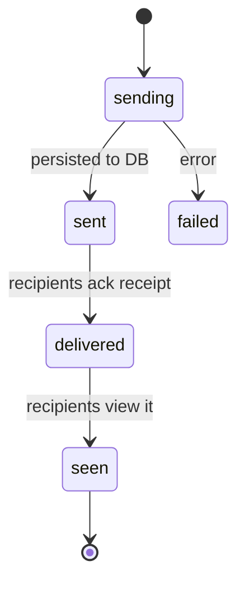
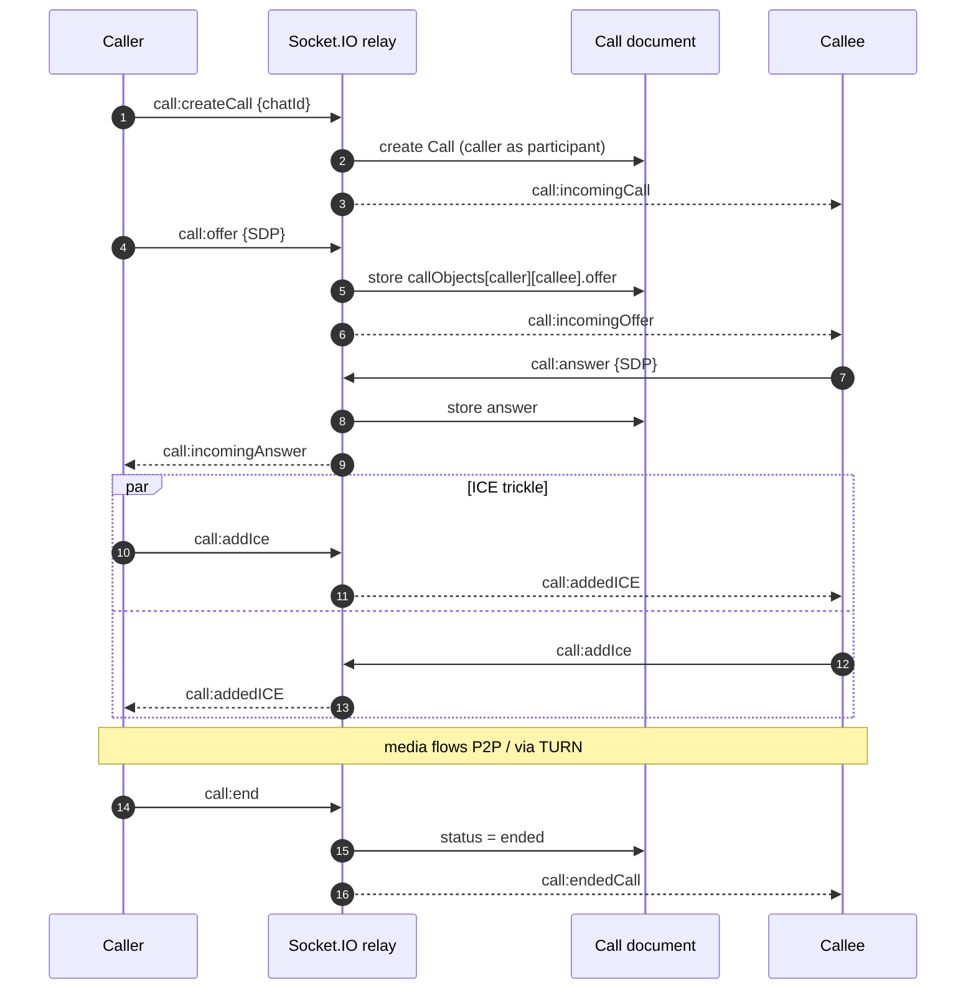
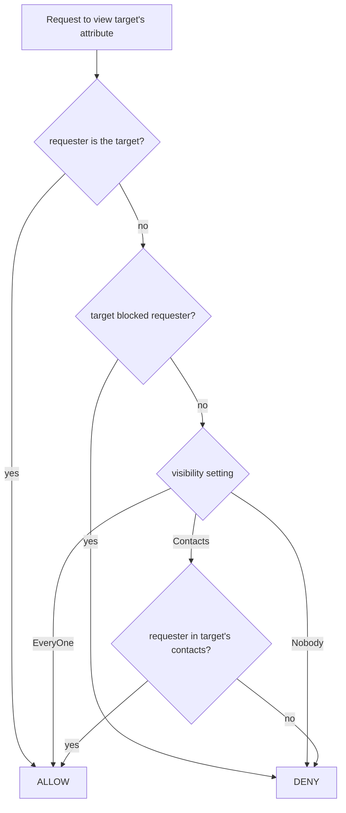
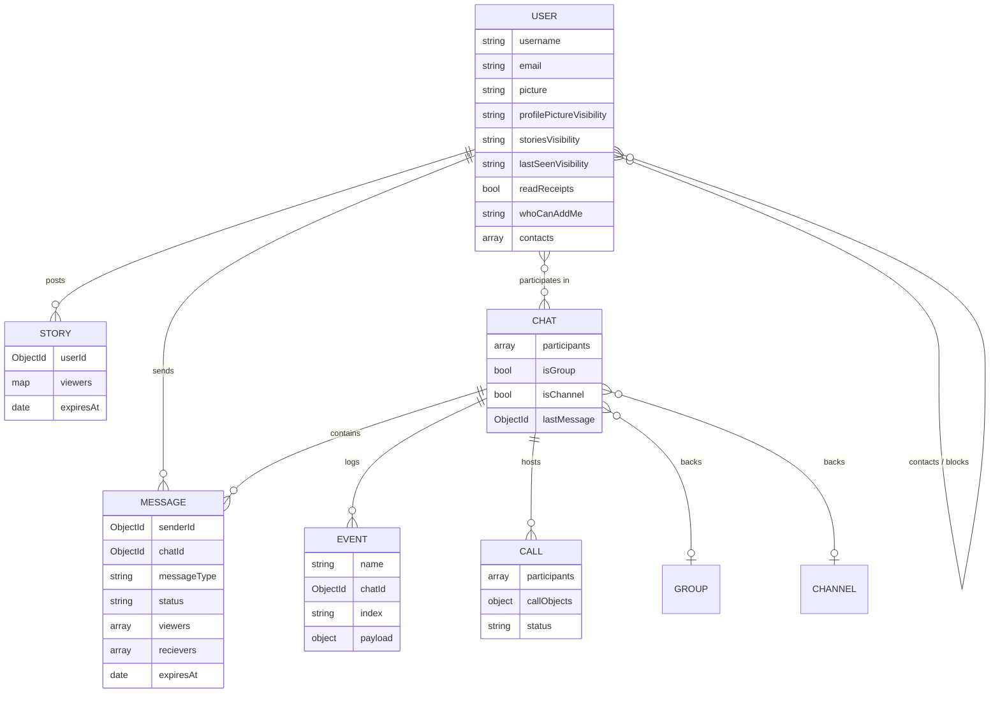
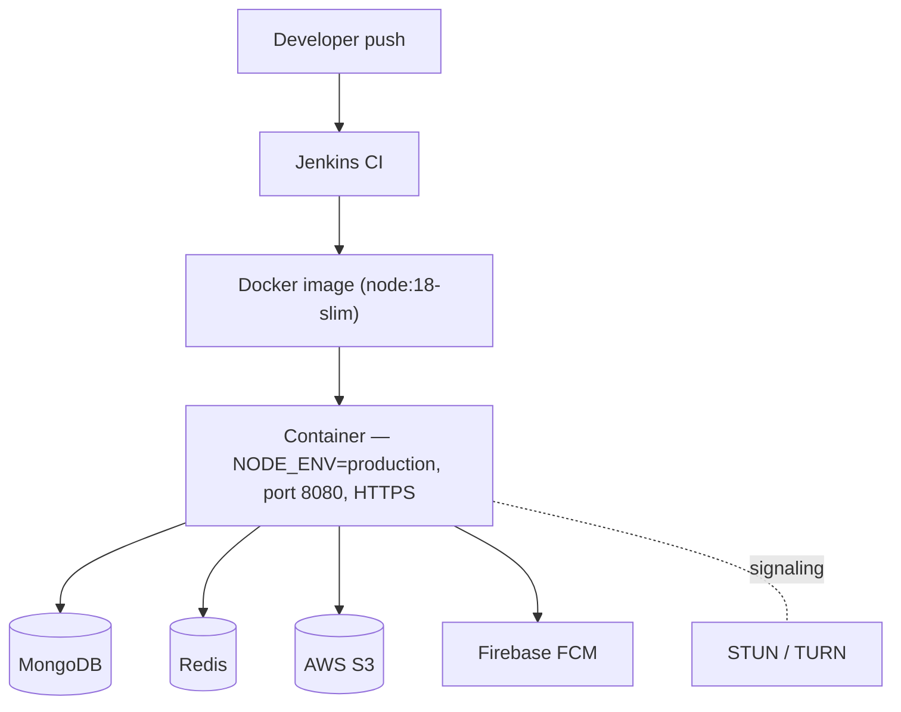

# TeleGrammy Backend Architecture & System Design

Visual reference for how the backend is structured and how its main flows work. All diagrams are
[Mermaid](https://mermaid.js.org/) and render automatically on GitHub. See [README.md](README.md) for
setup and the feature list.

---

## 1. System context

Where the backend sits between clients and the external services it depends on.



## 2. Layered architecture

The request path is **routes → controllers/handlers → services → models → MongoDB**. All database
access is confined to the services layer; controllers (REST) and event handlers (sockets) share it.



## 3. Runtime wiring

How the single Node process boots the HTTP/HTTPS server, the socket server, and the DB connection.



## 4. One-to-one message send (sequence)

Includes block enforcement, optional AI moderation, persistence, and the event-logged fan-out.

```mermaid
sequenceDiagram
  autonumber
  participant A as Sender
  participant IO as Socket.IO handler
  participant CS as chatService
  participant MS as messageService
  participant EV as Event log
  participant B as Recipient(s)

  A->>IO: message:send {chatId, ...}
  IO->>CS: getBasicChatById + getChatParticipants
  IO->>IO: block check (isBlockedBy)
  alt either side blocked
    IO-->>A: {status:"error", "User is blocked"}
  else allowed
    opt group has AI filter
      IO->>IO: classify text/image; redact if flagged
    end
    IO->>MS: createMessage
    MS->>EV: logThenEmit("message:sent")
    EV-->>B: message:sent (to chat room)
    IO-->>A: ack {id}
    B->>IO: event:ack
    IO->>MS: updateMessageRecivers
    IO-->>A: message:delivered
    B->>IO: message:seen
    IO-->>A: message:seen (if reader's readReceipts on)
  end
```

## 5. Event-sourced delivery & offline replay

Every state-changing emit is persisted to a per-chat, monotonically-indexed event log first, so a
reconnecting client can replay exactly what it missed (at-least-once delivery).



## 6. Message delivery state



## 7. WebRTC call signaling (sequence)

The server is a **signaling relay**, not a media server: SDP offers/answers and ICE candidates are
relayed over sockets and stored per participant-pair so late joiners can catch up. Media flows
peer-to-peer (or via TURN).



## 8. Privacy visibility decision

The shared `canView(target, requester, setting)` helper (`src/utils/visibility.js`) gates profile
picture, stories, and last seen the same way.



## 9. Data model (key collections)

Simplified entity-relationship view of the main Mongoose models.



## 10. Deployment



---

_Diagrams reflect the code as of this revision. If a flow changes, update the corresponding block here._
