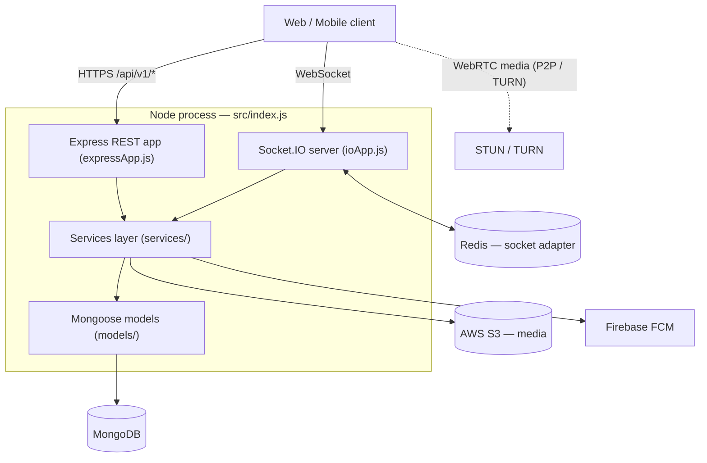

# TeleGrammy — Backend

TeleGrammy is a Telegram-style messaging platform. This repository is its backend: a Node.js service
that exposes a RESTful API for account, profile, chat, group, channel, and admin operations, and a
Socket.IO real-time layer for live messaging, typing indicators, read receipts, and WebRTC call
signaling. Data is stored in MongoDB (via Mongoose); Redis fans real-time events out across instances;
media lives in AWS S3; and push notifications go through Firebase Cloud Messaging.

---

## Tech stack

| Concern | Technology |
|---|---|
| Runtime / language | Node.js, JavaScript (CommonJS) |
| HTTP framework | Express 4 |
| Real-time | Socket.IO 4 + `@socket.io/redis-adapter` (Redis pub/sub) |
| Database | MongoDB via **Mongoose 8** (schemas in `src/models`) |
| Auth | Passport (Google / GitHub / Facebook OAuth) + JWT in cookies; `express-session` + `connect-mongo` |
| Media storage | AWS S3 (presigned URLs) |
| Content moderation | AWS Rekognition + `@xenova/transformers` (optional, per-group) |
| Calls | WebRTC signaling over Socket.IO; STUN/TURN via `/ice-servers` |
| Push | Firebase Admin (FCM topics) |
| Email | SendGrid / AWS SES |
| Testing | Jest (`src/tests`) |
| Lint / format | ESLint (airbnb-base) + Prettier |
| Container / CI | Docker (`node:18-slim`), Jenkins |

## Architecture



- **Entry point:** `src/index.js` → `src/server.js` creates the HTTP (dev) or **HTTPS (prod)** server, attaches Socket.IO, connects Mongoose, and starts listening.
- **REST layer** (`src/expressApp.js`): routers mounted under `/api/v1/*`, wrapped controllers (`utils/catchAsync`), a central error handler (`middlewares/globalErrorHandling`), and Swagger UI at `/api-docs`.
- **Real-time layer** (`src/ioApp.js`): one Socket.IO server behind a JWT handshake guard, with three connection handlers — default (1:1 messaging + calls), group, and channel namespaces. Every state-changing emit is persisted first (`eventHandlers/utils/utilsFunc.js#logThenEmit`) to a per-chat **event log**, so a reconnecting client can replay everything it missed (at-least-once delivery).
- **Services layer** (`src/services/*`): the data-access boundary — all Mongoose queries live here, one module per domain.

> 📐 **Full diagram set** — sequence diagrams (message send, WebRTC calls), the event-sourced delivery model, the privacy decision flow, the data model, and deployment: see **[ARCHITECTURE.md](ARCHITECTURE.md)**.

## Features by module

- **Authentication & registration** — email/password signup with emailed confirmation codes, reCAPTCHA, Google/GitHub/Facebook OAuth, password reset, and "log out of all devices".
- **User profile** — update picture (S3), bio, screen name, username, phone; change email via a pending-email + confirmation-code flow; view activity (status, last seen).
- **Privacy** — visibility settings for profile picture / stories / last seen (`Everyone` / `Contacts` / `Nobody`), block & unblock, read-receipt toggle, and "who can add me to groups/channels" (`Everyone` / `Admins`) — enforced on reads, sends, and add-member operations.
- **Messaging** — 1:1 and group/channel messages; edit, delete, reply, forward; mentions; delivered/seen (double-tick) status; drafts; typing indicators; pinned messages; self-destructing messages (TTL); in-chat search.
- **Groups & channels** — create/manage groups and broadcast channels, admin roles & permissions, invite links, member/subscriber management, size limits, announcements.
- **Voice calls** — 1:1 and group calls via WebRTC signaling over sockets, call log & duration, join-in-progress.
- **Stories** — 24-hour ephemeral text/media stories with viewer tracking (auto-expire via a MongoDB TTL index).
- **Notifications** — FCM push for messages, mentions, and calls; unread counts.
- **Admin & search** — user management, AI content filtering per group; search users, chats, and public groups/channels.

## Getting started

### Prerequisites

- **Node.js** (Docker image uses Node 18; `package.json` declares `engines.node >= 10.4.0`)
- **MongoDB** (connection string)
- **Redis** — required: the socket layer connects to Redis on startup
- For full functionality: **AWS S3** credentials, **Firebase** service-account values, **SendGrid** key, and **STUN/TURN** servers

### Install

```bash
npm install
```

### Environment variables

Create a `.env` file (git-ignored) with settings for MongoDB, Redis, JWT/session secrets, the OAuth
providers (Google / GitHub / Facebook), AWS S3, Firebase Cloud Messaging, SendGrid email, and
STUN/TURN servers.

### Run MongoDB & Redis (quick local option)

```bash
docker run -d -p 27017:27017 --name telegrammy-mongo mongo
docker run -d -p 6379:6379   --name telegrammy-redis redis
```

Then point the app's database and Redis connection settings at these local instances.

### Start the server

```bash
# Development (auto-reload)
npm start                       # nodemon src/index.js  (HTTP)

# Production
NODE_ENV=production node src/index.js   # HTTPS; expects TLS certs at /etc/ssl/certs/tls.{key,crt}
```

> The Docker image runs `node src/index.js` with `NODE_ENV=production` on port 8080.

### Run the tests

```bash
npm test        # Jest (src/tests)
npm run lint    # ESLint
```

## API & real-time overview

### REST route groups (all under `/api/v1` unless noted)

| Mount | Purpose |
|---|---|
| `/user`, `/auth` | accounts, login/logout, OAuth, password reset |
| `/user/profile` | profile info, picture, email change, activity |
| `/user/stories` | create / view / delete stories |
| `/privacy/settings` | visibility, blocking, read receipts, who-can-add-me |
| `/chats` | chat list, single chat + paginated messages |
| `/messaging/upload` | media upload (S3) |
| `/groups`, `/channels` | group & channel management |
| `/call` | call log, ongoing call, join call |
| `/search` | users / chats / public groups & channels |
| `/notification` | notification settings & device tokens |
| `/admins` | admin dashboard |
| `/ice-servers` | STUN/TURN config for WebRTC (not under `/api/v1`) |
| `/api-docs` | Swagger UI |

### Key socket events

| Direction | Events |
|---|---|
| Messaging (client → server) | `message:send`, `message:update`, `message:delete`, `message:seen`, `message:pin`, `message:unpin`, `draft`, `typing`, `event:ack` |
| Messaging (server → client) | `message:sent`, `message:isSent`, `message:delivered`, `message:seen`, `message:updated`, `message:deleted`, `message:pin`, `message:unpin`, `message:mention`, `draft`, `typing` |
| Calls (client → server) | `call:createCall`, `call:offer`, `call:answer`, `call:addIce`, `call:reject`, `call:end` |
| Calls (server → client) | `call:incomingCall`, `call:incomingOffer`, `call:incomingAnswer`, `call:addedICE`, `call:endedCall` |
| Groups / channels | `addingGroupMember`, `addingGroupMemberV2`, `addingChannelSubscriper`, … |

## Project structure

```
src/
  index.js / server.js / expressApp.js / ioApp.js   entry + REST/socket wiring
  config/            ICE servers, socket, Firebase config
  models/            Mongoose schemas (user, chat, message, story, call, channel, group, event, …)
  services/          data-access layer (one module per domain)
  controllers/       REST handlers
  eventHandlers/     socket handlers (connection, chat, calls, group/channel namespaces, utils)
  routes/            Express routers
  middlewares/       auth (HTTP + socket), AWS/S3, OAuth strategies, AI moderation
  classes/           AI moderation strategy/factory
  utils/             tokens, cookies, email, Firebase, snowflake IDs, catchAsync
  tests/             Jest suites
  docs/              Swagger / OpenAPI definitions
```

## Engineering highlights

- **Event-sourced real-time delivery** — every socket emit is persisted to a per-chat, indexed event log, so a reconnecting client replays exactly what it missed (at-least-once delivery).
- **Horizontally scalable sockets** — a Redis pub/sub adapter fans events out across instances.
- **WebRTC calling** — SDP/ICE signaling over Socket.IO with STUN/TURN for NAT traversal, including join-in-progress.
- **Unified privacy layer** — a single visibility resolver enforces per-user rules for profile picture, stories, last seen, blocking, read receipts, and group-add policy.
- **AI content moderation** — optional per-group text and image filtering (AWS Rekognition + transformers).
- **Secure auth** — JWT-in-cookies with refresh-token rotation, plus Google / GitHub / Facebook OAuth.

## Credits

Built as a university software-engineering course project by the TeleGrammy team: Ali Bahr, Mostafa Rabie,
Mohamed Abdelmeged, Abd El-Rahman Mostafa, and Mohamed El-Bohy.
